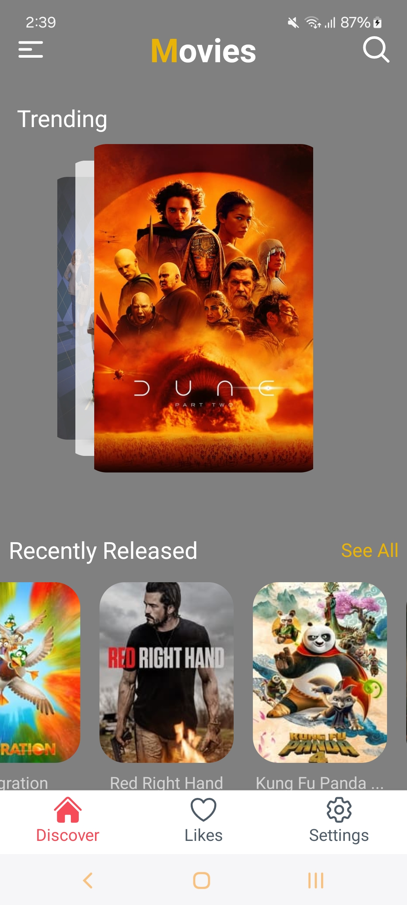
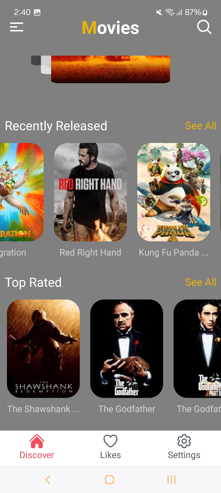
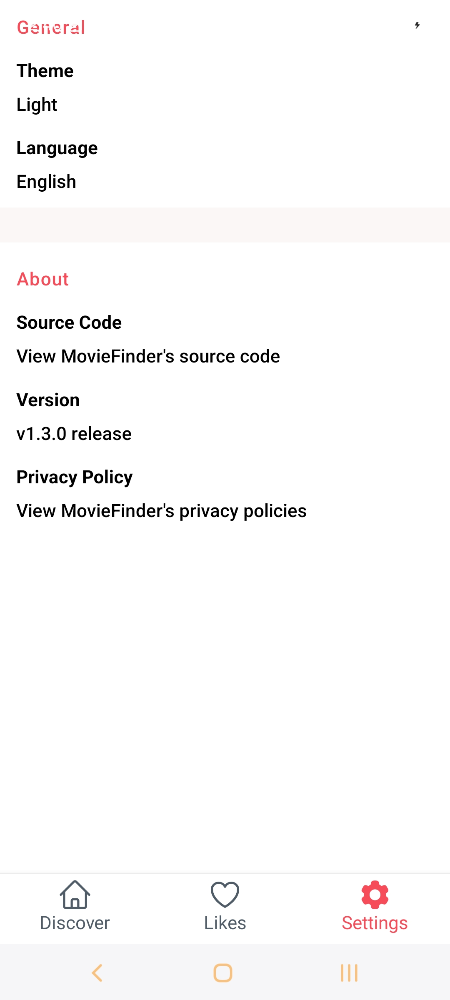
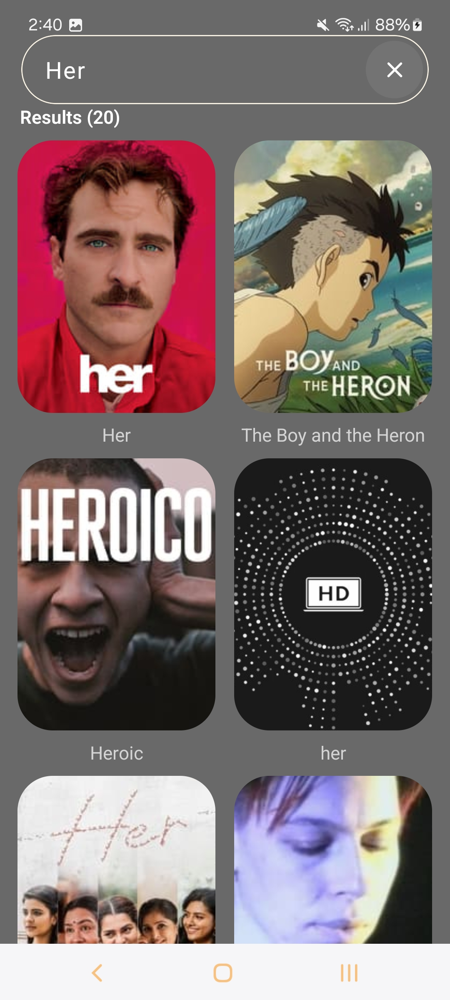
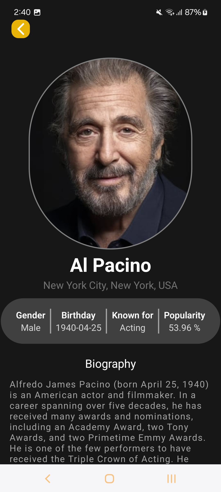
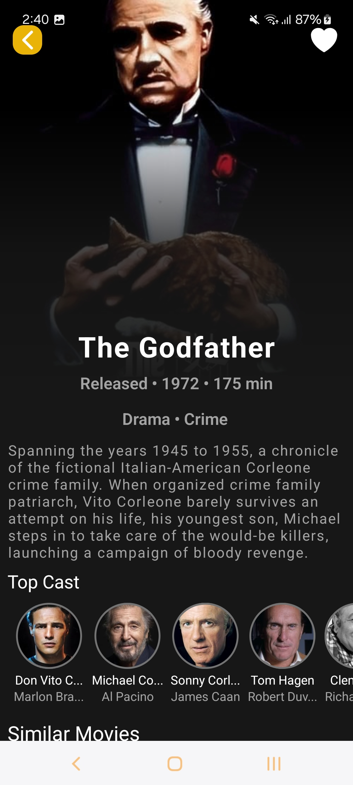

# `Movie Finder` React Native App

This is an Expo-managed React Native app for getting all the latest news and information about movies; it currently uses
the <a href="https://www.themoviedb.org/?language=en-CA">TMDB</a> API as its backend.

The trello board I use for keeping track of all the tickets of this project is shared
in [here](https://trello.com/b/lB655CdN/movie-finder).

## Contents

* [Demonstration](#demonstration)
    * [Videos](#videos)
    * [Screenshots](#screenshots)
* [Tech Stack](#tech-stack)
* [Contributors](#Contributors)

## Demonstration

### Videos

<b>Demo 1</b>

https://private-user-images.githubusercontent.com/8706521/311159902-cecbb10a-24eb-4fc1-90d3-10f9d578a1a0.mp4

<b>Demo 2</b>

https://private-user-images.githubusercontent.com/8706521/311159910-2fee4de4-e056-4ab3-baa8-24023f0cae56.mp4

### Screenshots

## Tech Stack

- [TypeScript](https://www.typescriptlang.org/) - Superset of JavaScript programming language with syntax for types.
- [JSX](https://react.dev/learn/writing-markup-with-jsx) - A syntax extension for JavaScript that allows for HTML-like
  markup to be written inside a JavaScript/TypeScript file.
- [React Navigation](https://reactnavigation.org/) - A routing and navigation module for React Native apps.
- [Axios](https://axios-http.com/docs/intro) - A promise-based HTTP client for JavaScript.
- [AsyncStorage](https://react-native-async-storage.github.io/async-storage/) - An asynchronous, unencrypted,
  persistent, key-value storage solution for React Native applications.

## Contributors

Main developer: [Hojat Ghasemi](mailto:hojat72elect@gmail.com)
 

