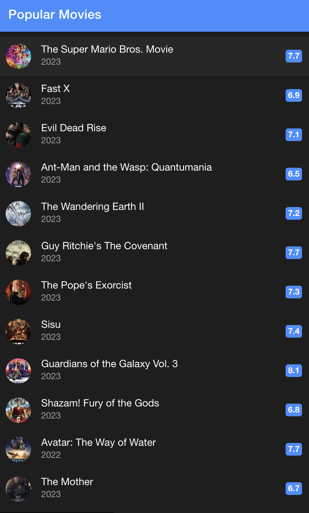
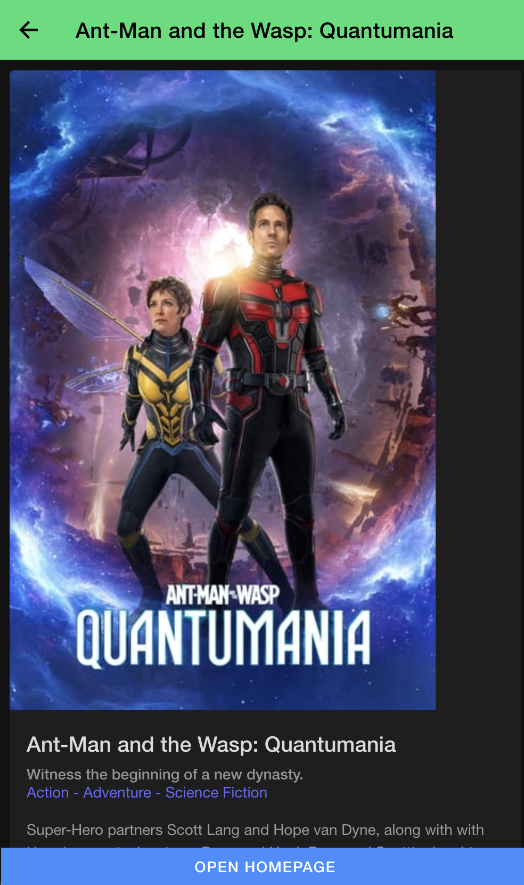

## Movie Finder

Ionic is an amazing framework which helps you convert your web app into a multiplatform mobile application without making too
much of change in your codebase. <b>Movie Finder</b> is
an [Angular + Ionic](https://ionicframework.com/docs/angular/overview) app I made to experiment further with this idea.

As an angular app, this code base is fully written in TypeScript and SCSS but UI is completely made via Ionic
components. The app currently connects to [TMDB](https://developer.themoviedb.org/reference/intro/getting-started) API
for fetching popular movies. It also allows the user to see
latest information about a specific movie.

### ScreenShots:

### Technologies:

Technologies currently used in this project:
<ul>
<li><a href="https://ionicframework.com">Ionic</a></li>
<li><a href="https://angular.io/">Angular</a></li>
<li><a href="https://www.typescriptlang.org/">TypeScript</a></li>
<li>SCSS</li>
<li>HTML 5</li>
</ul>
